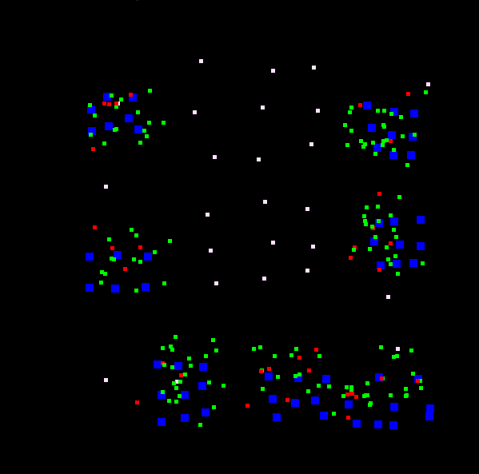
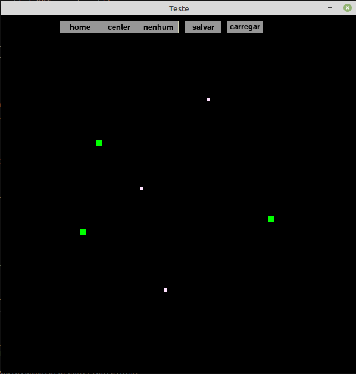

<p align="center" width="100%">
     
</p>

## Sobre o projeto


Usando como o modelo matemático usado pelo [Safe blues](https://www.cell.com/patterns/fulltext/S2666-3899(21)00034-9?_returnURL=https%3A%2F%2Flinkinghub.elsevier.com%2Fretrieve%2Fpii%2FS2666389921000349%3Fshowall%3Dtrue#secsectitle0035), implementamos uma simulação visual de um modelo de contaminação por Covid-19.Criamos uma estrutura para representar o ambiente 2d, com auxilio de uma interface visual e interativafeita compygameessa estrutura  ́e a representa ̧c ̃ao de um mapa onde posicionamos as estruturas b ́asicas domodelo e ela armazena em um arquivo .csv suas posições em coordenadas cartesianas.  As estruturas b ́asicass ̃ao ascasas, onde podem residir um numero x de agentes, oscentrosque s ̃ao o locais que os agentes devemvisitar,  representam  locais  de  trabalho,  lojas,  shoppings  e  etc,  e  por  fim  os agentes que  representam  as pessoas.  No caso da ferramenta visual podemos posiciona apenas casas e centros, os agentes são definidos apartir das casas.

### Ferramentas usadas

* [Pygame](https://www.pygame.org/news)
* [Pygame_GUI](https://pygame-gui.readthedocs.io/en/latest/)
* [pygame-widgets](https://github.com/AustL/PygameWidgets)


### Pre-requisitos

Para executar essa simulção você deve instalar as dependencias necessarias
* Pygame
  ```sh
  pip install pygame
  ```
* Pygame_GUI
  ```sh
  pip install pygame_gui -U
  ```
* pygame-widgets
  ```sh
  python -m pip install pygame-widgets
  ```

### Instalação

1. Clone este repositorio.
   ```sh
   git clone https://github.com/Paulo-Aragao/simulation-of-covid-propagation.git
   ```
2. Navegue até o diretorio simulation-of-covid-propagation


## Executando

Para usar o editor de mapas você deve usar o comando: 
 ```sh
   python3 editor.py
```
<p align="center" width="100%">
     
</p>
Você pode montar o mapa da simulação da maneira que quiser, usando o botão de home para adcionar casas e o botão center para adcionar um centro.

Para executar a simulação use o comando:
```sh
   python3 simulation_pygame.py
```
<!-- CONTACT -->


